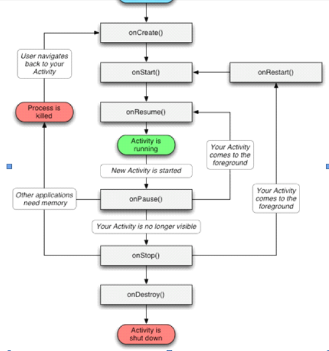

###<center>fragment详解</center>
fragment在平常开发过程中算是用的比较多的，也是android比较基础和重要的一个知识点，在这里有必要总结一下。
首先声明，fragment应该使用support v4包内的，最低可兼容至android 1.6，app包下的fragment只能兼容至3.0
#####关于fragment可归纳出一下几个特征
<li>fragment总是作为activity界面的组成部分。fragment可调用getActivity（）获取所在的activity。activity可调用FragmentManager的findFramentById()或者findFragmentByTag()获取Fragment
<li>activity可调用FragmentManager的add(),remove(),replace()等方法动态添加，删除，替换Fragment
<li>一个activity可以组合多个fragment，一个fragment也可以被多个activity复用
<li>fragment可以响应自己的输入时间，并拥有自己的生命周期，但其声明周期直接被所属activity的生命周期控制
#####通常来说，创建fragment需要实现如下几个方法
<li>构造方法（一般无参，且只有一个，因为推荐使用bundle传递参数给fragment）
<li>onCreate()创建后回调的方法，初始化组件
<li>onCreateView()绘制组件是回调的方法，返回该fragment返回的view
<li>onPause()用户离开该fragment时回调的方法（我才疏学浅，还没用过，一般第一个和第三个是一定要的）

##### 关于fragment的子类，主要是ListFragment，和ListActivity类似。
```java
    public class BookListFragment extends ListFragment
	{
	private Callbacks mCallbacks;
	// 定义一个回调接口，该Fragment所在Activity需要实现该接口
	// 该Fragment将通过该接口与它所在的Activity交互
	public interface Callbacks
	{
		public void onItemSelected(Integer id);
	}

	@Override
	public void onCreate(Bundle savedInstanceState)
	{
		super.onCreate(savedInstanceState);
		// 为该ListFragment设置Adapter
		setListAdapter(new ArrayAdapter<BookContent.Book>(getActivity(),
				android.R.layout.simple_list_item_activated_1,
				android.R.id.text1, BookContent.ITEMS));
	}
	// 当该Fragment被添加、显示到Activity时，回调该方法
	@Override
	public void onAttach(Activity activity)
	{
		super.onAttach(activity);
		// 如果Activity没有实现Callbacks接口，抛出异常
		if (!(activity instanceof Callbacks))
		{
			throw new IllegalStateException(
				"BookListFragment所在的Activity必须实现Callbacks接口!");
		}
		// 把该Activity当成Callbacks对象
		mCallbacks = (Callbacks)activity;
	}
	// 当该Fragment从它所属的Activity中被删除时回调该方法
	@Override
	public void onDetach()
	{
		super.onDetach();
		// 将mCallbacks赋为null。
		mCallbacks = null;
	}
	// 当用户点击某列表项时激发该回调方法
	@Override
	public void onListItemClick(ListView listView
		, View view, int position, long id)
	{
		super.onListItemClick(listView, view, position, id);
		// 激发mCallbacks的onItemSelected方法
		mCallbacks.onItemSelected(BookContent
			.ITEMS.get(position).id);
	}

	public void setActivateOnItemClick(boolean activateOnItemClick)
	{
		getListView().setChoiceMode(
				activateOnItemClick ? ListView.CHOICE_MODE_SINGLE
						: ListView.CHOICE_MODE_NONE);
	}
	}
```

##### fragment和activity通信
将fragment添加到activity中方法
<li>xml中<fragment.../>
<li>java代码中FragmentTransation
对象的add()方法
需要注意的是：FragmentTransation修改fragment后要调用commit()，调用commit()之前可以用addToBackStack（）将事务添加到Back栈，使得按back键能回到前一个fragment状态</br>
为了让fragment与activity交互，可以在Fragment 类中定义一个接口，并在activity中实现。Fragment在他们生命周期的onAttach()方法中获取接口的实现，然后调用接口的方法来与Activity交互。</br>

```java
public class MyListFragment extends Fragment {
  // ...
  // Define the listener of the interface type
  // listener is the activity itself
  private OnItemSelectedListener listener;

  // Define the events that the fragment will use to communicate
  public interface OnItemSelectedListener {
    public void onRssItemSelected(String link);
  }

  // Store the listener (activity) that will have events fired once the fragment is attached
  @Override
  public void onAttach(Activity activity) {
    super.onAttach(activity);
      if (activity instanceof OnItemSelectedListener) {
        listener = (OnItemSelectedListener) activity;
      } else {
        throw new ClassCastException(activity.toString()+ " must implement MyListFragment.OnItemSelectedListener");
      }
  }

  // Now we can fire the event when the user selects something in the fragment
  public void onSomeClick(View v) {
     listener.onRssItemSelected("some link");
  }
}

public class RssfeedActivity extends FragmentActivity implements
  MyListFragment.OnItemSelectedListener {
    DetailFragment fragment;

  @Override
  protected void onCreate(Bundle savedInstanceState) {
      super.onCreate(savedInstanceState);
      setContentView(R.layout.activity_rssfeed);
      fragment = (DetailFragment) getSupportFragmentManager()
            .findFragmentById(R.id.detailFragment);
  }

  // Now we can define the action to take in the activity when the fragment event fires
  @Override
  public void onRssItemSelected(String link) {
      if (fragment != null && fragment.isInLayout()) {
          fragment.setText(link);
      }
  }
}
```
简单的数据传递直接用bundle。
activity中调用Fragment.setArgument(bundle)</br>
fragment中调用getArguments()获取</br>
##### fragment的生命周期</br>

</br>与activity的生命周期联系起来</br>

</br>（顺便复习下activity的生命周期）</br>

##### 开发中常用的套路：fragment+viewpager实现滑动切换tab
自定义一个FragmentPagerAdapter ，将所有要用的fragments加入ArrayList，FragmentPagerAdapter设置给viewpager，将fragments和viewpager藕合起来。然后viewpager中实现滑动的最重要的三个方法

```java
    viewPager.setAdapter(new MyFragmentPagerAdapter(getSupportFragmentManager(), fragmentList));
        //ViewPager显示第一个Fragment
        viewPager.setCurrentItem(0);
        //ViewPager页面切换监听
        viewPager.setOnPageChangeListener(new ViewPager.OnPageChangeListener() {
            @Override
            public void onPageScrolled(int position, float positionOffset, int positionOffsetPixels) {
                //根据ViewPager滑动位置更改透明度，0当前状态，1正在滑动，2滑动完毕
                int diaphaneity_one=(int)(255 * positionOffset);
                int diaphaneity_two=(int)(255 * (1 - positionOffset));
                switch (position){
                    case 0:
                        tvMessageNormal.getBackground().setAlpha(diaphaneity_one);
                        tvMessagePress.getBackground().setAlpha(diaphaneity_two);
                        tvContactsNormal.getBackground().setAlpha(diaphaneity_two);
                        tvContactsPress.getBackground().setAlpha(diaphaneity_one);
                        tvMessageTextNormal.setTextColor(Color.argb(diaphaneity_one, 153, 153, 153));
                        tvMessageTextPress.setTextColor(Color.argb(diaphaneity_two, 69, 192, 26));
                        tvContactsTextNormal.setTextColor(Color.argb(diaphaneity_two,153,153,153));
                        tvContactsTextPress.setTextColor(Color.argb(diaphaneity_one,69, 192, 26));
                        break;
                    case 1:
                        tvContactsNormal.getBackground().setAlpha(diaphaneity_one);
                        tvContactsPress.getBackground().setAlpha(diaphaneity_two);
                        tvDiscoveryNormal.getBackground().setAlpha(diaphaneity_two);
                        tvDiscoveryPress.getBackground().setAlpha(diaphaneity_one);
                        tvContactsTextNormal.setTextColor(Color.argb(diaphaneity_one, 153, 153, 153));
                        tvContactsTextPress.setTextColor(Color.argb(diaphaneity_two, 69, 192, 26));
                        tvDiscoveryTextNormal.setTextColor(Color.argb(diaphaneity_two,153,153,153));
                        tvDiscoveryTextPress.setTextColor(Color.argb(diaphaneity_one,69, 192, 26));
                        break;
                    case 2:
                        tvDiscoveryNormal.getBackground().setAlpha(diaphaneity_one);
                        tvDiscoveryPress.getBackground().setAlpha(diaphaneity_two);
                        tvMeNormal.getBackground().setAlpha(diaphaneity_two);
                        tvMePress.getBackground().setAlpha(diaphaneity_one);
                        tvDiscoveryTextNormal.setTextColor(Color.argb(diaphaneity_one, 153, 153, 153));
                        tvDiscoveryTextPress.setTextColor(Color.argb(diaphaneity_two, 69, 192, 26));
                        tvMeTextNormal.setTextColor(Color.argb(diaphaneity_two,153,153,153));
                        tvMeTextPress.setTextColor(Color.argb(diaphaneity_one,69, 192, 26));
                        break;
                }
            }

            @Override
            public void onPageSelected(int position) {

            }

            @Override
            public void onPageScrollStateChanged(int i) {

            }
        });
```
以上就是fragment一些比较基础的内容，相关demo可以自行搜索。
