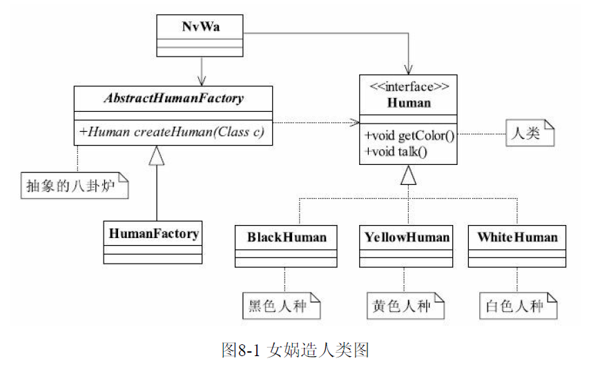

### 设计模式之工厂方法模式
---
* 定义：定义一个创建对象的接口，但让实现这个接口的类来决定实例化哪个类。工厂方法让类的实例化推迟到子类中进行。
* UML类图：</br>

* 举例：女娲造人（详情见《设计模式之禅》第八章）</br>

</br>这里重点给出工厂的代码
```java
public abstract class AbstractHumanFactory {
public abstract < T extends Human> T createHuman(Class< T> c);
}
```
这里T必须满足：是class类型，并且是human的实现类。
工厂子类如下：
```java
public class HumanFactory extends AbstractHumanFactory {
public < T extends Human> T createHuman(Class< T> c){
//定义一个生产的人种
Human human=null;
try {
//产生一个人种
human = (T)Class.forName(c.getName()).newInstance();
} catch (Exception e) {
System.out.println("人种生成错误！");
}
return (T)human;
}
}
```

* 完整的实现代码模板如下：
```java
//抽象产品类
abstract class Product{
    public void method1(){}//公共方法
    public abstract void method2();//抽象方法
}

//具体产品类
class CreateProduct1 extends Product{
    public void method2(){}
}

class CreateProduct2 extends Product{
    public void method2(){}
}

//抽象工厂
abstract class Creator{
    public abstract < T extends Product> T createProduct(Class< T> c);
}

//具体工厂
class CreateCreator extends Creator{
    public < T extends Product> T createProduct(Class< T> c){
        Product p = null;
        try{
            p = (Product) Class.forName(c.getName()).newInstance();
        }catch(Exception e){
        }
        return (T)p;
    }
}
//场景类
class Client{
    public static void main(String[] args){
        Creator creator = new CreateCreator();
        Product p = creator.createProduct(CreateProduct1.class);
    }
}
```

* 优点：
	* 首先：良好的封装性，降低模块间的耦合。比如创建一个产品对象，只需要知道其类名或者约束字符串就可以了。
	* 其次：扩展性好。增加产品类时只需要适当修改工厂具体类或者新建工厂类就可以拥抱变化。
	* 再次：屏蔽产品类。产品类的实现如何变化，调用者都不用关心，只要求产品接口保持不变。例如：使用JDBC连接数据库，数据库从MySQL切换到Oracle，只需要改动一下驱动的名称。
	* 最后：工厂方法模式是典型的解耦框架。高层模块只需要知道产品的抽象类，其他的实
现类都不用关心，符合迪米特法则，我不需要的就不要去交流；也符合依赖倒置原则，只依
赖产品类的抽象；当然也符合里氏替换原则，使用产品子类替换产品父类

* 使用场景
	* 工厂方法模式是new一个对象的替代品，所以在需要new 对象的地方都可以使用。但需慎重考虑是否要增加一个工厂类进行管理，以免增加代码复杂度。
	* 需要灵活的、可扩展的框架时，可以考虑。ex：设计一个连接邮件服务器的框架，POP3、IMAP、HTTP三协议的连接方式作为产品类来处理。当某些邮件服务器扩展了webservice协议时，只需要增加webservice的产品类
	* 可以用在异构项目中。
ex：通过webservice与一个非java的项目交互，虽然webServcie号称是可以做到异构系统的同构化，但是在实际的开发中，会碰到类型问题、WSDL文件的支持问题等。从WSDL中产生的对象都认为是一个产品，然后由具体工厂管理，减少与外围的耦合。
	* 可以使用在测试框架中。ex：测试类A，就需要把与A有联系的B也同时产生出来。可以使用工厂方法模式把B虚拟出来，避免A与B 的耦合。可对比JMock、EasyMock。
* 扩展
	* 简单工厂模式：一个模块只需要一个工厂类，没必要new工厂实例出来，只需要使用静态方法即可。</br>

```java
//具体工厂
class CreateCreator {
    public static < T extends Product> T createProduct(Class< T> c){
        Product p = null;
        try{
            p = (Product) Class.forName(c.getName()).newInstance();
        }catch(Exception e){
        }
        return (T)p;
    }
}
//场景类
class Client{
    public static void main(String[] args){
            Product p = CreateCreator.createProduct(CreateProduct1.class);
    }
}
```
* 多工厂类：项目比较复杂，初始化一个对象比较费力（设定初始值），所有产品类都放在一个工厂方法中进行初始化会使代码结构不清晰。为每个产品定义一个创造者，然后由调用者自己去选择与哪个工厂方法关联。
```java
//具体工厂1
class CreateCreator1 extends Creator{
    public Product createProduct(){
        return new CreateProduct1();
    }
}
//具体工厂2
class CreateCreator2 extends Creator{
    public Product createProduct(){
        return new CreateProduct2();
    }
}
//场景类
class Client{
    public static void main(String[] args){
        Product cp1 = (new CreateCreator1()).createProduct();
        Product cp2 = (new CreateCreator2()).createProduct();
    }
}
```
* 替代单例模式.不让通过正常方式new一个产品对象，而是通过工厂用反射的方法创建对象。项目中可以建一个单例构造器，只要输入单例的类型就可以获得唯一的实例。通过获得类构造器，然后设置访问权限，生成一个对象，然后提供外部访问，保证内存
中的对象唯一。
```java
class Singleton{
    private Singleton(){}
    public void doSomething(){}
}
class SingletonFactory{
    private static Singleton single;
    static{
        try {
            Class cls = Class.forName(Singleton.class.getName());
            Constructor constructor = cls.getDeclaredConstructor();
            constructor.setAccessible(true);
            single = (Singleton) constructor.newInstance();
        } catch (Exception e) {
            e.printStackTrace();
        }
    }
    public static Singleton getSingleton(){
        return single;
    }
}
```
* 延迟初始化：一个对象被消费完毕，不立即释放，工厂类保持其初始状态，等待再次被使用。
```java
public class ProductFactory {
	// 缓存容器
	private static final Map< String, Product> prMap = new HashMap< String, Product>();
	public static synchronized Product createProduct(String type) throws Exception {
		Product product = null;
		if (prMap.containsKey(type)){
			product = prMap.get(type);
		} else {
			if (type.equals("Product1")) {
				product = new ConcreteProduct1();
			} else {
				product = new ConcreteProduct2();
			}
			// 同时把对象放到缓存容器中
			prMap.put(type, product);
		}
		return product;
	}
}
```
延迟加载框架是可以扩展的，例如限制某一个产品类的最大实例化数量，可以通过判断
Map中已有的对象数量来实现，这样的处理是非常有意义的，例如JDBC连接数据库，都会
要求设置一个MaxConnections最大连接数量，该数量就是内存中最大实例化的数量。