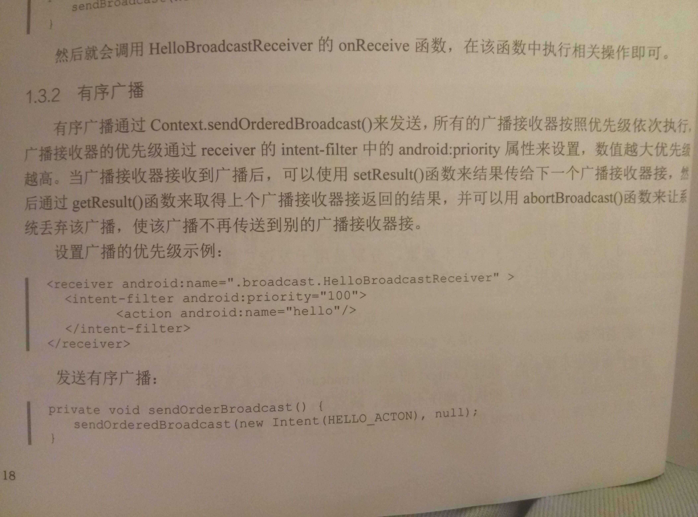
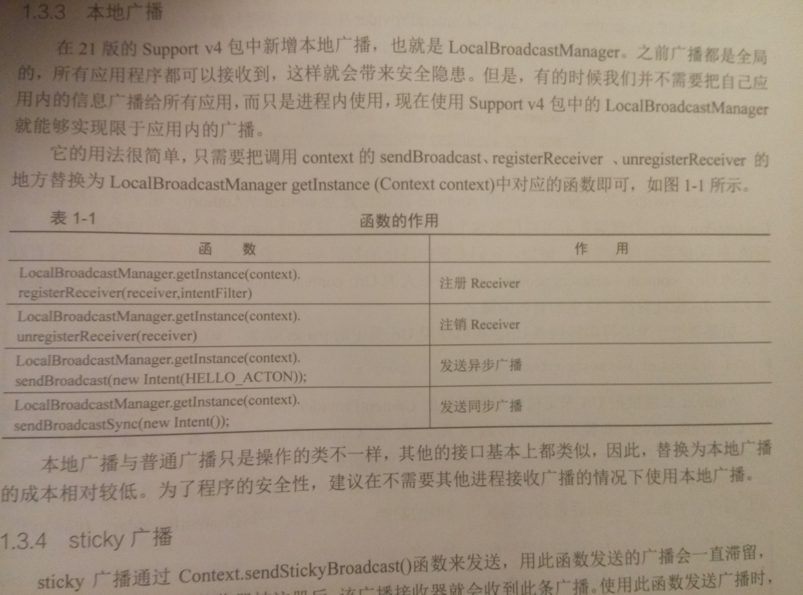

## <center>android开发进阶笔记一：四大组件</center>
### Activity的四种启动模式
<li>standard（标准启动模式）
同一（Task）任务栈中可以存在多个Activity(可相同)的实例。先启动的activity放栈底
<li>singleTop(Task栈顶单例模式)
与standard基本相同，但是当要启动的activity已位于task栈顶时，系统不会创建实例，而是直接复用已有的activity实例。并且会调用该实例的onNewIntent()函数将intent传递到该对象。当要启动的activity已在栈内但不位于task栈顶时，和standard一样，创建实例。
<li>singleTask（task栈内单例模式）
和singleTop基本相同，唯一不同在于当要启动的activity已在栈内但不位于task栈顶时会直接将其上的activity弹出栈。
<li>singleInstance(全局单例模式)
系统中只有一个该activity实例，第一次创建实例时会在一个全新的Task栈中创建

### service和AIDL
<li>普通service
service执行与UI进程中，所以不要在service中执行耗时操作。
service的生命周期：onCreate(),onStartCommand(),onDestroy()
一旦调用startService()相应的服务就会启动，调用onCreate()和onStartCommand()，一直运行，直到stopService()或者stopSelf()函数被调用。每个服务仅存在一个实例。
要执行耗时操作时可以在onStartCommand()里新开一个线程来执行耗时操作。
service也要在AndroidManifest.xml里面注册。

    <service android:name=".service.Myservice"/>

<li>IntentService
	适用于完成短时间的耗时操作
IntentService将用户的请求执行在一个子线程中，用户只需要覆写onHandleIntent函数，并且在函数中完成自己的耗时操作即可。任务执行完毕后IntentService会调用stopSelf（）自我销毁。
<li>运行在前台的service
　Service默认是运行在后台的，因此，它的优先级相对比较低，当系统出现内存不足的情况时，它就有可能会被回收掉。如果希望Service可以一直保持运行状态，而不会由于系统内存不足被回收，可以将Service运行在前台。前台服务不仅不会被系统无情地回收，它还会在通知栏显示一条消息，下拉状态栏后可以看到更加详细的信息。例如，墨迹天气在前台运行了一个Service，并且在Service中定时更新通知栏上的天气信息

```java
public class WeatherService extends Service {
	private static final int NOTIFY_ID = 123;
	@Override
	public void onCreate() {
	super.onCreate();
	showNotification();
	}
	/**
	* 在通知栏显示天气信息
	*/
	private void showNotification() {
	NotificationCompat.Builder mBuilder =
	new NotificationCompat.Builder(this)
	.setSmallIcon(R.drawable.weather)
	.setContentTitle(getText(R.string.the_day))
	.setContentText(getText(R.string.weather));
	// 创建通知被点击时触发的Intent
	Intent resultIntent = new Intent(this, MainActivity.class);
	// 创建任务栈Builder
	TaskStackBuilder stackBuilder = TaskStackBuilder.create(this);
	stackBuilder.addParentStack(MainActivity.class);
	stackBuilder.addNextIntent(resultIntent);
	PendingIntent resultPendingIntent =
	stackBuilder.getPendingIntent(
	0, PendingIntent.FLAG_UPDATE_CURRENT);
	mBuilder.setContentIntent(resultPendingIntent);
	NotificationManager mNotifyMgr =
	(NotificationManager) getSystemService(Context.NOTIFICATION_SERVICE);
	// 构建通知
	final Notification notification = mBuilder.build() ;
	// 显示通知
	mNotifyMgr.notify(NOTIFY_ID, notification);
	// 启动为前台服务
	startForeground(NOTIFY_ID, notification);
	}
	}
```

### AIDL（android接口描述语言）
AIDL（Android接口描述语言）是一种接口描述语言，通常用于进程间通信。编译器根据AIDL文件生成一个系列对应的Java类，通过预先定义的接口以及Binder机制达到进程间通信的目的。说白了，AIDL就是定义一个接口，客户端(调用端)通过bindService来与远程服务端建立一个连接，在该连接建立时会返回一个IBinder对象，该对象是服务端Binder的BinderProxy，在建立连接时，客户端通过asInterface函数将该BinderProxy对象包装成本地的Proxy，并将远程服务端的BinderProxy对象赋值给Proxy类的mRemote字段，就是通过mRemote执行远程函数调用。
这部分我看的不是很懂，AIDL使用并不难，但是理解起来可能不容易。这里给出一篇博客供参考：[<android开发进阶——从小工到专家>学习之AIDL](http://www.jianshu.com/p/68defd0b0016)
### broadcast广播
android 广播机制是典型的发布-订阅模式，即我们常说的观察者模式。一个广播可以有若干个接收者。广播机制最大的特点是发送方并不关心接收者是否接收到数据，也不管其怎样处理数据，通过这样的形式来实现接，收双方的完全解耦和。
android广播机制包括三个基本要素：Broadcast，BroadcastReceiver，和intentandroid广播可分为普通广播，有序广播，本地广播，sticky广播。
<li>普通广播
通过Context.sendBroadcast()方法来发送。它是完全异步的。 所有的receivers接收器的执行顺序不确定。效率更高，但是接收者不能将处理结果传递给下一个接收者，并且无法终止广播intent的传播，直到没有匹配的广播接收器为止。
1.自定义一个广播接收器，继承自BroadcastReceiver，然后在onReceive()里面执行操作
2.注册广播
1）静态：

```xml
    <receiver android:name=".boradcast.MyBroadcastReceiver">
            <intent-filter>
                <action android:name="hello"/>
            </intent-filter>
        </receiver>
```
2）动态：
```java
     private void RegisterHelloBroadcast(){
        unregisterReceiver(new HelloBroadcastReceiver(),new IntentFilter(HELLO_ACTION));
    }
```
如果是在activity或者fragment中动态测试，记得在onDestroy()中注销广播。注册之后就可以发送广播了。
```java
    private void sendNormalBroadcast(){
        sendBroadcast(new Intent(HELLO_ACTION));
    }
```
<li>有序广播
书上讲的很简洁我就直接贴图了。

<li>本地广播


### contentProvider
主要用于对外共享数据，通过contentProvider把数据共享给其他应用访问，以增删查改。
使用contentProvider共享数据好处是：统一了数据访问方式，实际上是对SQliteOpenHelper的进一步封装，通过uri映射选择需要操作数据库中的哪个表。
这部分比较多，明天再更。