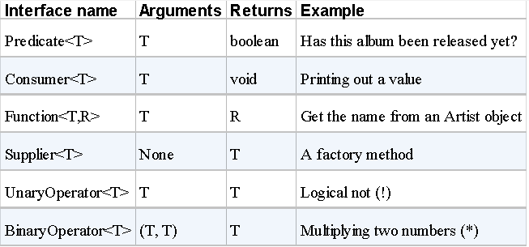

## java8:函数式编程
---

* chapter2：lambda表达式
    * 编写lambda表达式的不同例子
     ```java
     Runnable noArguments = () -> System.out.println("Hello World"); // <1>

     ActionListener oneArgument = event -> System.out.println("button clicked"); // <2>

     Runnable multiStatement = () -> { // <3>
        System.out.print("Hello");
        System.out.println(" World");
     };

     BinaryOperator<Long> add = (x, y) -> x + y; // <4>

     BinaryOperator<Long> addExplicit = (Long x, Long y) -> x + y; // <5>
     ```
     所有lambda表达式中的参数类型都是编译器推断出来的，当然也可以显式声明。
    * 匿名内部类访问外部变量时要求是final的，而在java8中lambda表达式访问外部变量有了小小的优化，只要变量引用不变就会隐式地当作final域来使用。
    ```java
    //可行
    String name = getUserName();
    button.addActionListener(event -> System.out.println("hi " + name));
    //不可行
    String name = getUserName();
    name = formatUserName(name);
    button.addActionListener(event -> System.out.println("hi " + name));
    ```
    * 函数接口：只有一个方法的接口
    

        图为java中重要的函数接口
    * 类型推断
```java
Map<String, Integer> oldWordCounts = new HashMap<String, Integer>(); // <1>
Map<String, Integer> diamondWordCounts = new HashMap<>(); // <2>
Predicate<Integer> atLeast5 = x -> x > 5;
BinaryOperator<Long> addLongs = (x, y) -> x + y;
```

* chapter3:流
    * 惰性求值：返回值为stream。及早求值：返回值是另一个值或者为空。类似builder模式
    * 常用流操作
        * 创建stream
            * Stream接口的静态工厂方法
                * of
                * generate
                * iterate
            * 通过Collection子类获取Stream
        * distinct：去重
        * limit: 对一个Stream进行截断操作，获取其前N个元素，如果原Stream中包含的元素个数小于N，那就获取其所有的元素
        * collect(Collectors.toList())):生成list，及早求值
        * map：元素转换。变种：mapToInt，mapToLong和mapToDouble。比如mapToInt就是把原始Stream转换成一个新的Stream，这个新生成的Stream中的元素都是int类型。之所以会有这样三个变种方法，可以免除自动装箱/拆箱的额外消耗
        * filter
        * flatMap：把每个元素转化成stream对象，再把多个stream对象连接成一个stream对象。
        * skip: 返回一个丢弃原Stream的前N个元素后剩下元素组成的新Stream，如果原Stream中包含的元素个数小于N，那么返回空Stream
        * reduce：```int count = Stream.of(1, 2, 3).reduce(0, (acc, element) -> acc + element);```
        * 搜索相关
            * allMatch：是不是Stream中的所有元素都满足给定的匹配条件
            * anyMatch：Stream中是否存在任何一个元素满足匹配条件
            * findFirst: 返回Stream中的第一个元素，如果Stream为空，返回空Optional
            * noneMatch：是不是Stream中的所有元素都不满足给定的匹配条件
            * max和min：使用给定的比较器（Operator），返回Stream中的最大|最小值:`min(Comparator.comparing(track -> track.getLength()))`
* chapter 4:类库
    * Optional:可为空可不为空
```java
Optional<String> a = Optional.of("a");
assertEquals("a", a.get());
// END value_creation

// BEGIN is_present
Optional emptyOptional = Optional.empty();
Optional alsoEmpty = Optional.ofNullable(null);

assertFalse(emptyOptional.isPresent());

// a is defined above
assertTrue(a.isPresent());
// END is_present

// BEGIN orElse
assertEquals("b", emptyOptional.orElse("b"));
assertEquals("c", emptyOptional.orElseGet(() -> "c"));
// END orElse
```

* chapter 5:高级集合类和收集器
