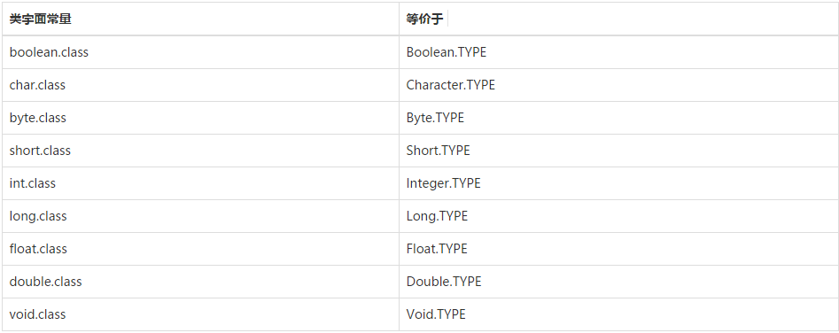

### thinking in java(下)
---

* chapter 14 : Type Information
    * 为什么需要RTTI：运行时发现和使用类的信息
    * class对象：
        * 每个类都有一个class对象。每当编写并编译了一个新类，就会产生一个Class对象（更恰当地说，是被保存在一个同名的.class文件中）。为了生成这个类的对象，运行这个程序的Java虚拟机将使用被称为“类加载器”的子系统。
        * 所有的类都是在对其第一次使用时，动态加载到JVM中的。当程序创建第一个对类的静态成员的引用时，就会加载这个类。这个证明构造器也是类的静态方法，因此使用new操作符创建类的新对象也会被当作对类的静态成员的引用。
        * Java程序在它开始运行之前并非被完全加载，其各个部分是在必需时才加载的。
        * 获取对class对象的引用，使用`Class.forName(全限定类名，包含包名)`或者`类名.class`（类字面常量）。前者会初始化该class对象，后者不会。使用后者更安全也更简单，因为他在编译时就会受到检查，因此不需要置于try语句块中，并且根除了对forName()方法的调用，因此也更高效。类字面常量不仅可应用于普通的类，也可以应用于接口，数组，以及基本数据类型。对于基本数据类型的包装器类，还有标准字段TYPE。

            

        * class类的常用方法
            >Class#getName()：返回此类的全限定名（包名+类名）
</br>Class#getSimpleName()：返回此类的类名
</br>Class#getCanonicalName()：返回此类的全限定名（包名+类名）
</br>Class#isInterface()：判定此类是不是接口
</br>Class#getInterfaces()：返回此类实现的接口的Class类对象。
</br>Class#getSuperClass()：返回此类的基类的Class类对象。 ！注意：当得到的Class是Object，会返回null。
</br>Class#newInstance()：返回此类的一个对象。（注：此类必须有默认构造器）
</br>Class#getModifiers()：获得一个类的修饰词，比如final, static, abstract等。和Modifier配合使用，像这样：Modifier.isAbstract(Class#getModifiers())可以判断一个类是不是抽象类。

        * 为了使用类所做的准备工作包含：
            * 加载，类加载器执行。查找字节码，并从字节码中创建一个class对象。
            * 链接，验证类中的字节码，为静态域分配存储空间，并且如果必须的话，将解析这个类创建的对其它类的所有引用。
            * 初始化，如果该类具有超类，则对其初始化，执行静态初始化器和静态初始化。
            
            初始化被延迟到了对静态方法（构造器）或者非常数静态域进行首次引用时才执行。
        * 泛型语法：通过使用泛型语法，可以让编译器强制执行额外的类型检查。`Class<Integer> genericIntClass = int.class;`
        * 新的转型语法：
            ```java
            Building b = new House();
            Class<House> houseType = House.class;
            House h = houseType.cast(b); 
            h = (House)b;
            ```
    * 类型转换前先做检查
        * `if(x instanceof Dog) ((Dog)x).bark()`,instanceof运算符的动态等价:`Pet.class.isInstance(dog)`
    * instanceof与Class的等价性:instanceof保持了类型的概念，它表示“该类是否为某个类或是其派生类”，而equals()和==比较实际的Class对象，则不考虑继承，或者是这个确切的类型，或者不是。
    * RTTI和反射之间真正的区别在于，对RTTI来说，编译器在编译时打开和检查.class文件。而对于反射机制来说，.class文件在编译时是不可获取的，所以是在运行时打开和检查.class文件。

* chapter 15 ：Generics
    * 面向对象的泛化机制（多态）：将方法的参数设为基类，该方法可以接收这个基类中导出的所有类作为参数。考虑到除了final类和私有构造器的类不能扩展，其他所有类都可以被扩展，所以这种灵活性大多数时候也会带来一定的性能损耗。而泛型实现了参数化类型的概念。
    * 简单泛型
        * 可重用性：持有对象<持有object对象<泛型
        * 元组（tuple）：元组就是将一组对象直接打包存储进一个单一对象，这个容器只允许读取，不允许放入新的对象（这个概念也称为数据传送对象或信使）。可以解决想在一个return语句中返回多个对象的问题。泛型可以让我们很容易的创建元组。下面是利用泛型实现元组的一个实例：
        ```java
        public class TwoTuple<A,B> {
            public final A first ;
            public final B second ;
            public TwoTuple(A first,B second){
                this.first = first ;
                this.second = second ;
            }
            public String toString() { return first +"," +second ;}
        }
        ```
            java编程中的安全性原则：变量声明为private，使用get和set方法访问。final自带安全保险，一般声明为public，而且简洁明了。
        * 一个堆栈类：
* chapter 16 : Arrays
* chapter 17 : Containers in Depth
* chapter 18 : I/O
* chapter 19 : Enumerated Types
* chapter 20 : Annotations
* chapter 21 : Concurrency
* chapter 22 : Graphical User Interfaces