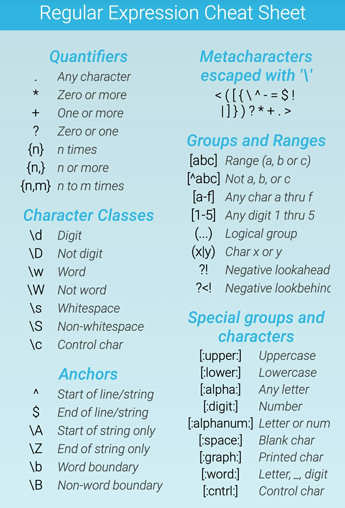

### thinking in java(下)
---
* chapter 12 ：Error Handling with Exceptions
    * finally：当你要把除内存之外的资源恢复到它们的初始状态时，就要用到finally子句。这种需要清理的资源包括：已经打开的文件或网络连接，你在屏幕上画的图形，甚至可以是外部世界的某个开关。
当涉及到break和continue语句的时候，finally子句也会得到执行。请注意，如果把finally子句和带标记的break及continue配合使用，在Java里就没必要使用goto语句了。
    * 更多细节参考：[http://jiangjun.name/thinking-in-java/28](http://jiangjun.name/thinking-in-java/28)

* chapter 13 : Strings
    * string类作为参数时采用值传递，即不改变原有string对象。区分：值传递，指针传递，引用传递。（C++常遇到的问题）
    * java并不允许重载运算符，用于string的+和+=是仅有的两个重载过的运算符,实质是利用StringBuilder的append()方法。（和c++大不同，c++重载运算符比较常见）在循环中直接利用string+=或者string+会创建多个StringBuilder对象，正确做法应该是循环外自己创建一个StringBuilder，然后循环内调用append()方法。诸如append(a+":"+c)这样想省事的语句也会创建多个StringBuilder，应该避免。
    * system.out.printf()和system.out.format()是等价的，用法和c语言一样
    * 新的格式化功能使用java.util.Formatter类处理。string.format()返回string对象
    * 正则表达式语法： 
    *  java的正则表达式中反斜杠与其他语言有不同含义，其他语言中\\表示要插入一个字面上的反斜杠，没有特殊含义；而java中的反斜杠则表示我要插入一个正则表达式的反斜杠，其后的字符具有特殊意义，比如表示一位数字，\\d 
	* string.split()方法将string从匹配的地方切开。
    * 关于pattern和matcher类：参考[http://www.cnblogs.com/ggjucheng/p/3423731.html](http://www.cnblogs.com/ggjucheng/p/3423731.html)

* chapter 14 : Type Information
    * 

* chapter 15 ：Generics
* chapter 16 : Arrays
* chapter 17 : Containers in Depth
* chapter 18 : I/O
* chapter 19 : Enumerated Types
* chapter 20 : Annotations
* chapter 21 : Concurrency
* chapter 22 : Graphical User Interfaces