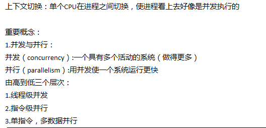
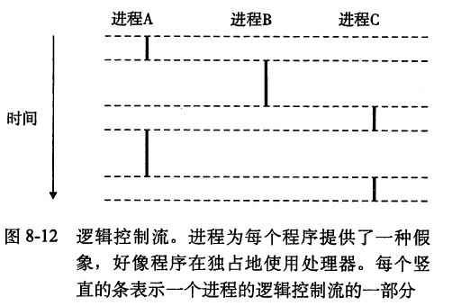

## <center>深入理解计算机系统部分笔记
---
写的比较杂，也没什么逻辑性.
* chapter1：计算机系统漫游



* chapter2：信息的表示和处理


* chapter5：优化程序性能
    * 妨碍优化的因素
        * 存储器别名使用
        * 函数副作用
    * 举例
```c++
//存储器别名使用
void twiddle1(int *xp ,int *yp){
    *xp+=*yp;
    *xp+=*yp;    
}
void twiddle2(int *xp,int *yp){
    *xp+=2* *yp;
}
//乍一看，两个函数功能一样，而且函数2比函数1有优化
//（twiddle2()只要求三次存储器引用：读*xp,读*yp,写*xp。
//而twiddle1()则执行了6次存储器引用）
```
但是考虑xp=yp时，函数1让*xp变成4倍,函数2则为3倍。
再举个例子
```c++
*q=x;
*p=y;
t=*q;//t=x or y，考虑p=q时
```
再来看看函数调用这个妨碍优化的因素
```c++
void func1(){
    return f()+f()+f()+f();
}
void func2(){
    return 4*f();
}
```
正常情况下以func2()作为func1()的优化是没问题的。但是考虑下面这个函数。
```
int counter=0;

int f(){
    return counter++;
}
```
该函数有副作用--会改变全局程序状态的一部分，改变调用它的次数会改变程序的行为。
解决方法是用内联函数替换优化函数调用。

* chapter6：存储器层次结构
    * 正金字塔结构：从上到下依次：寄存器，L1高速缓存(SRAM)，L2高速缓存(SRAM)，L3高速缓存(SRAM)，主存(DRAM)，本地二级存储（本地磁盘），远程二级存储（分布式文件系统，web服务器）。
    * 数据里通过主线在处理器和主存之间来回。总线事务分为读事物和写事务，读事务从主存传送数据到处理器，写事务从处理器传递数据到主存。总线是一组并行的导线能传递地址，数据，控制信号。
    * 磁盘构造：由大到小是：磁盘，盘片，表面，磁道，扇区，字节。
    * 对扇区的访问时间有三个主要部分:寻道时间，旋转时间，传送时间，

* chapter 8：异常
    * 异常可以分为四类：中断，陷阱，故障，终止。


    * 进程：系统中的程序都是运行在某个进程的上下文中的。进程提供给应用程序的关键抽象有：一个独立的逻辑控制流，一个私有的地址空间。


        一个逻辑流的执行在时间上和另一个流重叠，称为并发流。如上图中A,B并发的运行，A,C也一样，B,C则不是并发的。因为B的最后一条指令在C第一条指令之前执行。

        多个流并发执行的一般现象叫并发，一个进程和其他进程轮流运行的概念叫做多任务。并发与CPU核数或者计算机数无关，并行流是指两个流并发的运行在不同的处理器或者计算机上。并行流是并发流的真子集。

    * 内核为每个进程维持一个上下文，上下文就是内核重新启动一个被抢占的进程所需的状态。
    * 上下文切换
        * 1.保存当前进程的上下文。
        * 2.恢复某个先前被抢占的进程被保存的上下文
        * 3.将控制传递给这个新恢复 的进程。
    * 进程总是处于下面三种状态之一：
        * 运行：要么在cpu上执行，要么等待被执行切最终会被cpu调度。
        * 停止：进程的执行被挂起，且不能被调度。
        * 终止;进程永远停止了，导致的原因有三种：1.收到终止信号。2.从主程序返回。3.调用exit函数。
    * fork函数：新创建的子进程几乎但不完全与父进程相同。子进程得到父进程用户级虚拟地址空间相同但是独立的一份拷贝，包括文本，数据和bss段，堆和用户栈。子进程还得到和父进程任何打开文件描述符相同的拷贝。这意味着父进程调用fork时，子进程可以读取父进程打开的任何文件。父进程和子进程最大的不同是有不同的PID。fork函数调用一次返回两次，一次在父进程中，一次在子进程中。父进程中fork返回子进程的PID，子进程中fork返回0。子进程和父进程是并发运行的独立进程。
    * 回收子进程：进程终止时，内核不是立即将其清除。而是，进程一直保持在已终止的状态中，直到被他的父进程回收。一个终止了但还未进行回收的进程称为僵死进程（zombie）。如果父进程还没回收他的zombie子进程就终止了，那么内核就会安排init进程来回收他们。init进程的PID为1，而且是在系统初始化时由内核创建的。
    * 让进程休眠：sleep函数让进程挂起一段时间，如果请求的时间已到，返回0.否则返回剩余要休眠的秒数。pause函数让几次呢哼休眠，直到接到一个信号。

* chapter 12：并发编程